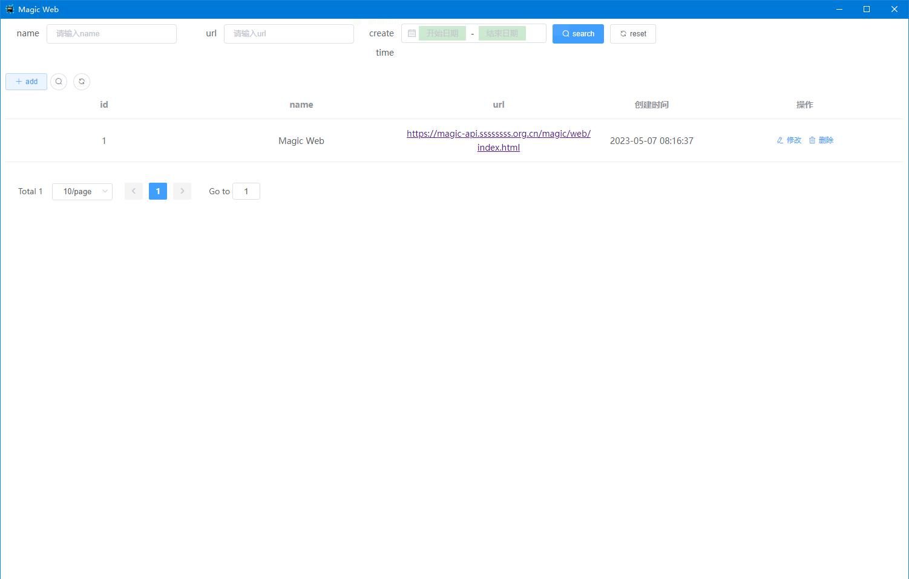
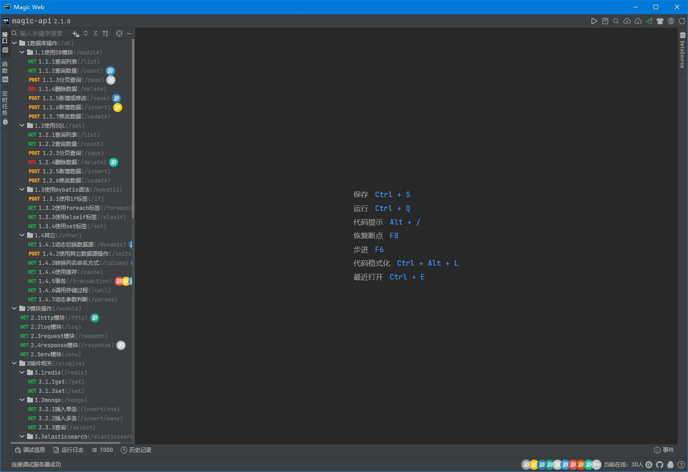

# tauri-magic-web
基于rust语言的tarui封装的Magic Web客户端GUI  
Magic Web client GUI encapsulated in tarui based on rust language


## Project setup
```
npm install
```

### Compiles and hot-reloads for development
```
npm run serve
```

### Compiles and minifies for production
```
npm run build
```

### Customize configuration
See [Configuration Reference](https://cli.vuejs.org/config/).
